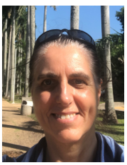

# About

<a href="ResumeOlaBeskidWojcicka.pdf">Download Resume</a>

For more than 20 years I contributed to the **design**, implementation and testing
of various complex software systems (mostly in **telecommunication** space).
I also worked on **installation** and **upgrade solutions** for network managing systems from one centralized location (so called one-push-button approach).
Additionally; some part of my career was designated to developing simulated environment for the **Big System Testing** focusing on systems managing devices operating with interfaces such as **CLI/TL1** and FTP/SFTP based on **Telnet/SSH**.
During my carrier I evolved from C-based solutions on HP-UX, to stand alone Java GUI client, to **Java-based Service Oriented Architecture** solutions utilizing **Tomcat** and WebLogic running on Solaris and Linux.

In the last four years I got involved in the design, implementation and automated testing of the network management solution made up of **micro-services** deployed in **Docker** containers.

I am an energetic person with excellent interpersonal skills working very well with international teams.

    

